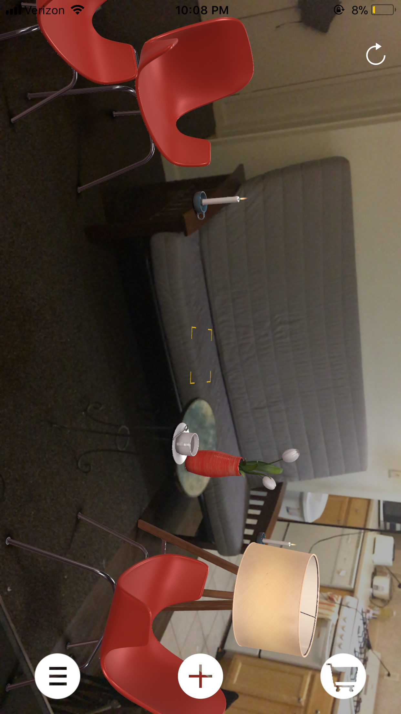
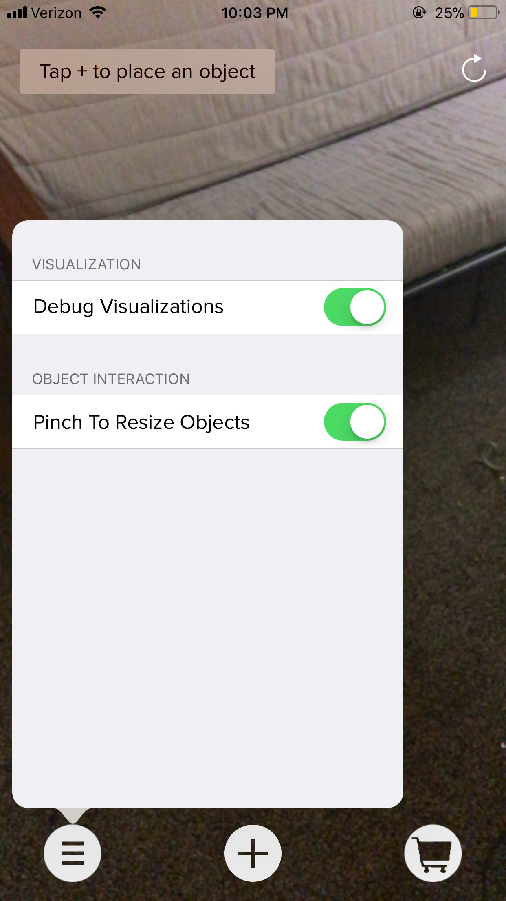
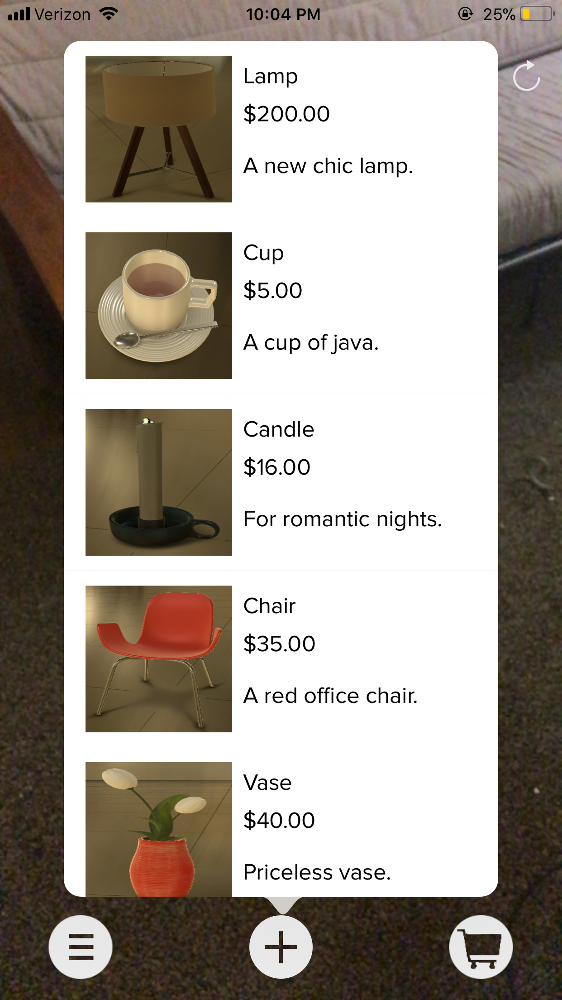
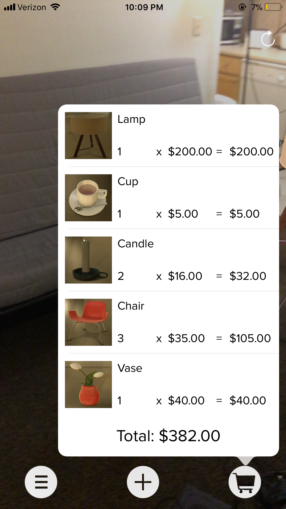
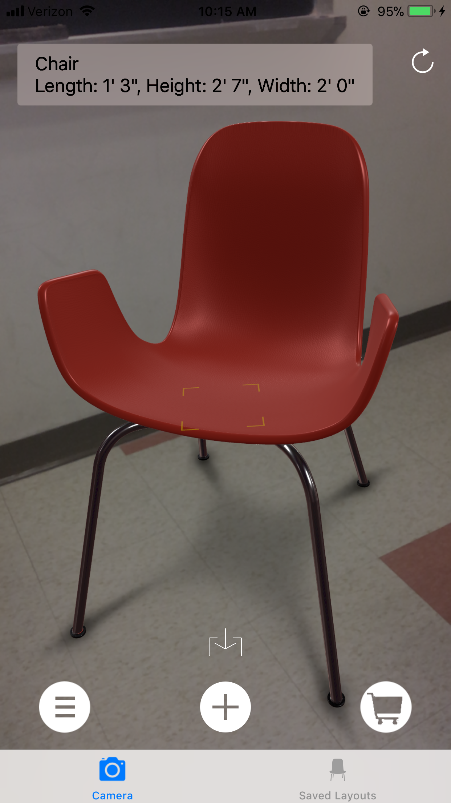
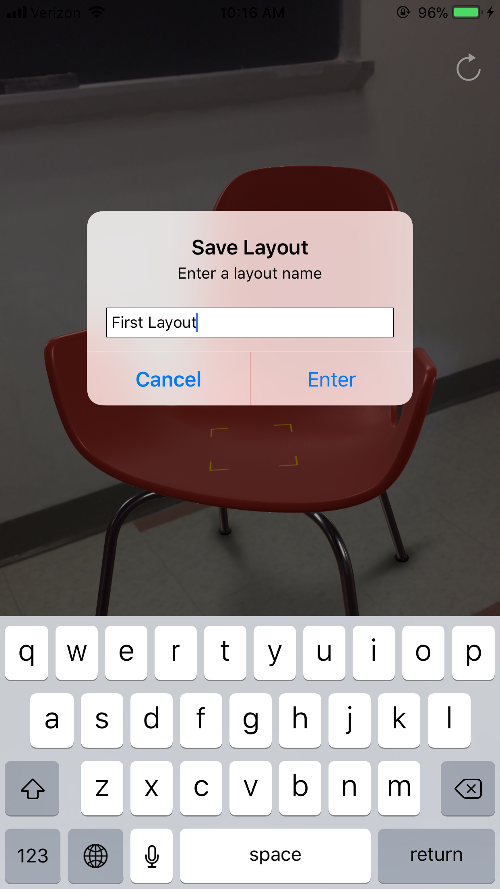
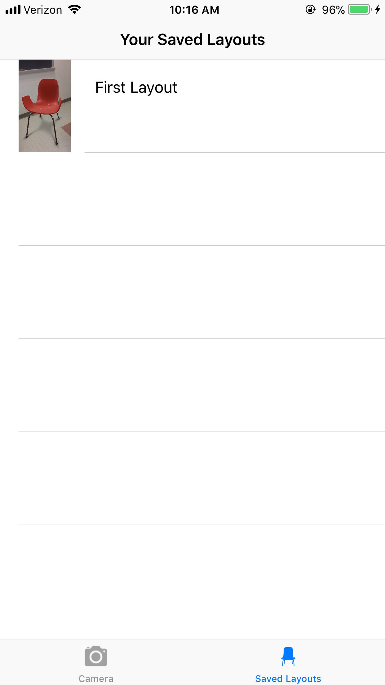
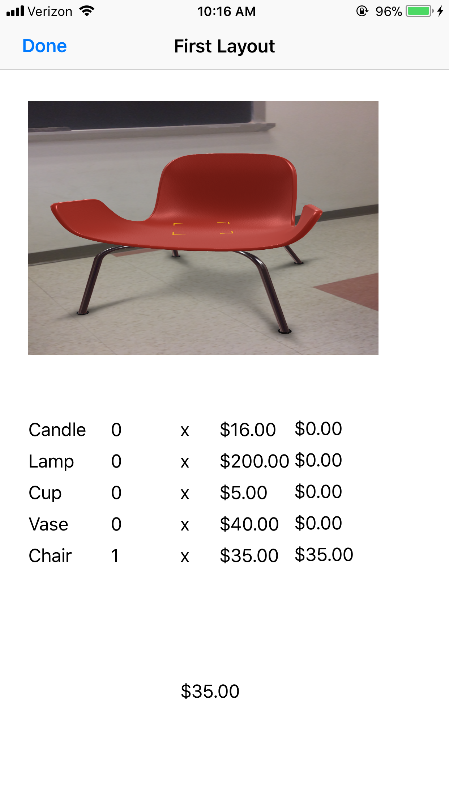

#  InteriAR

Created by Ashish Ramachandran and Herbert Li // Fall 2017

## Introduction

InteriAR is an application that allows users to plan and decorate any room, taking advantage of Apple’s new ARKit in order to provide a more detailed and immersive experience. InteriAR has a catalog of furniture and objects which the user can place virtually, keeping track of placed objects and the total running cost for the user. Since ARKit is required, InteriAR is only compatible with devices with an A9 (or later) processor and running iOS 11.

We started with ARKit base code from Apple [here][0] and continually added more features such as additional views, more model interaction with different gestures, adding multiple of the same object, debugging, and local layout saving. Unless noted in the block comment at the top of each file or within in-line comments, the code was written by us.

[0]:https://developer.apple.com/documentation/arkit/handling_3d_interaction_and_ui_controls_in_augmented_reality

## Features

### Camera View
- Settings popup menu with toggable debugging mode and "pinch to resize" option
- Furniture Catalog that displays all available models with name, price, description, and thumbnail
- Checkout popup that shows currently placed objects, total price, and redirects to an amazon link for the item (all current models in this application are not real)
- Main view incorporates gestures for rotating, resizing, and removing objects with popup display for object descriptions

### Saved Layouts View
- Previously saved layouts are saved locally and can be revisited by finding it on this screen
- Displays a thumbnail camera snapshot of when the user first saved the layout and will display the placed items' prices and total price

## Challenges
- Getting high-quality models is expensive, so we used Apple’s sample models
- Some weird bugs with gestures, especially the long press gesture for removing objects
- Problems with View Controllers (sometimes segues would mess up the AR world tracking or even reset the world)
- To solve the problem above, we ended up going with popup segues for our three menu items that are directly embedded in the camera view

## Sample Code

### Virtual Object

For our data model, we added fields for a thumbail image, description, name, quantity, price, and Amazon URL.

``` swift
var modelDescription: String
var modelPrice: Double
var modelQuantity: Int
var modelURL: String

// Store pointer to base virtual object
var parentObject: VirtualObject?

// The model's name is derived from the URL of the model
var modelName: String {
    return referenceURL.lastPathComponent.replacingOccurrences(of:
    ".scn", with: "")
}
```
[View in Source](x-source-tag://VirtualObject)

### Handling Multiple Objects

Each VirtualObject/SCNNode represented only a single object. As a result, we handled this by cloning the “base” VirtualObject instances. In order to keep our total quantities accurate, each VirtualObject had to store a pointer to its parent object.

``` swift
override func tableView(_ tableView: UITableView, didSelectRowAt indexPath: IndexPath) {
    let object = virtualObjects[indexPath.row]
    object.modelQuantity += 1

    // clone object to allow multiple instances of each
    // AR object to be placed
    let newObject = object.clone();
    newObject.parentObject = object
    delegate?.virtualObjectSelectionViewController(self, object: newObject)
    dismiss(animated: true, completion: nil)
}
```
[View in Source](x-source-tag://ObjectSelection)

## Further Steps

We would like to integrate our application with some database to allow users to upload and download their own models (e.g. Firebase) to make InteriAR more interactive and flexible. We would also like to have a more robust layout saving system and have the ability to save and render previously furnished rooms (rather than just prices and quantities) and send/share layouts.

## Media









